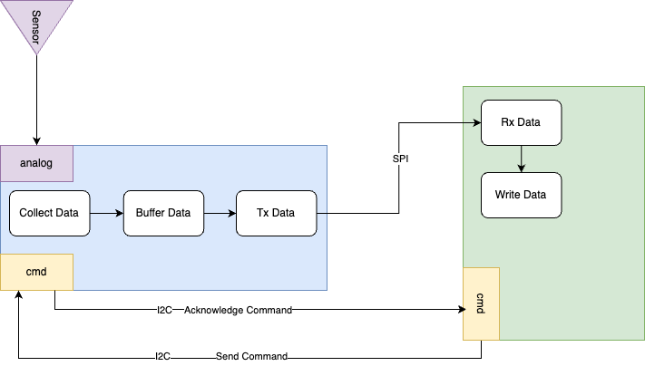

# Description
## Introduction
A Data Acquisition (DAQ) System utilizing open source hardware. 

This project is a successor to [DAQ](https://github.com/irfan-hossain/DAQ) which was a learning project to understand Arduino Uno registers. This current repository is Version 2, intended to be functional and usable.

## Hardware Requirements 
- Arduino Due Board (for data capture).
- Raspberry Pi (for data storage and processing).

## Feature Requirements 
- 10Hz - 100 MHz data capture freqeuncy range. 
- Capable of capturing data from 1-4 analog pins. 
- Partial data recovery in case of interruptions. 
- Continous mode and burst mode w/trigger. 
- Store data in CSV files.
- GUI for control and data plotting. 

## Iteration 1: High Level Block Diagram
First iteration will only have basic data collection and sotrage capabilities:

